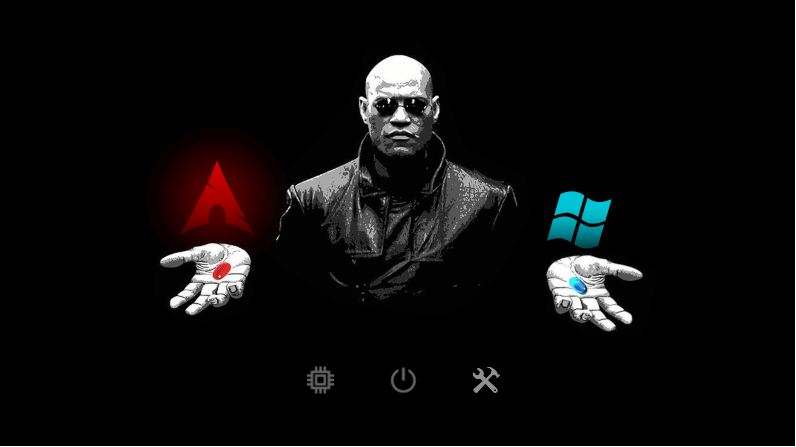

# Matrix Morpheus GRUB Theme

A minimalist Matrix-inspired GRUB theme featuring full-screen dynamic backgrounds that change between Linux and Windows.

---


## How it works

GRUB was not designed for full-screen icon-based layouts, so this theme relies on GRUB’s class system combined with pre-generated images.

### Menu entries and class matching
GRUB allows each menuentry to define one or more --class parameters.

This theme uses **only the first --class value** to determine which image to display.

For example:

```
menuentry 'Windows' --class windows --class os {
    ...
}
```
GRUB looks for `windows.png` and displays it full-screen for this entry.

### Note:

- Each entry must have a unique first --class value
- **Entries must be ordered**: Red pill (Linux) → Blue pill (Windows) → Function icons (firmware/utilities)
- Navigation uses Up/Down arrow keys

---

## Installation

### 1. Clone the repo

```shell
git clone https://github.com/Priyank-Adhav/Matrix-Morpheus-GRUB-Theme
cd Matrix-Morpheus-GRUB-Theme
```

### 2. Make the scripts executable

```shell
chmod +x install.sh image_generator.sh backup.sh
```

### 3. Backup your current GRUB configuration
Before making any changes, back up your existing GRUB configuration.

```shell
sudo ./backup.sh backup
```
If anything goes wrong, you can restore the previous state using the same script using:

```shell
sudo ./backup.sh restore
```

### 4. Verify GRUB menu entries

Menu entries must appear in this order:

1. Red pill entries

2. Blue pill entries

3. Function entries (firmware / utilities)

If your existing grub.cfg already satisfies this, no changes are required.

### 5.  Create a custom GRUB menu (if needed)

If your current grub.cfg doesn't match the required order:

1. Edit `/etc/grub.d/40_custom` with your desired entries

2. Disable auto-generation scripts to avoid conflicts:

```
sudo chmod -x /etc/grub.d/10_linux
sudo chmod -x /etc/grub.d/20_linux_xen
sudo chmod -x /etc/grub.d/30_os-prober
sudo chmod -x /etc/grub.d/30_uefi-firmware
```

### 7. Run the installer

Once the menu entries are correct:
```
sudo ./install.sh
```

### 8. Reboot

Reboot your system to test the new theme.


## Troubleshooting

### Fallback GRUB menu is shown instead of the graphical theme

If, after rebooting, you see the following message on the GRUB screen:

```
Graphical boot menu failed to load. Using fallback GRUB menu.
```

GRUB was unable to load the graphical theme and has reverted to the built-in text menu.

This usually happens for one of the following reasons:

#### 1. Theme images are missing or incorrectly named

Make sure that:

- Each menu entry has a unique first --class

- A corresponding image file exists with the same name (for example, windows.png)

#### 2. Incorrect GRUB resolution values

If the resolution in theme.txt does not match the actual GRUB graphics mode, the image may fail to render.

Verify that:

- You selected the correct resolution values during the theme installation

- The icon_width, icon_height, and item_height values in Matrix/theme.txt reflect that resolution
---